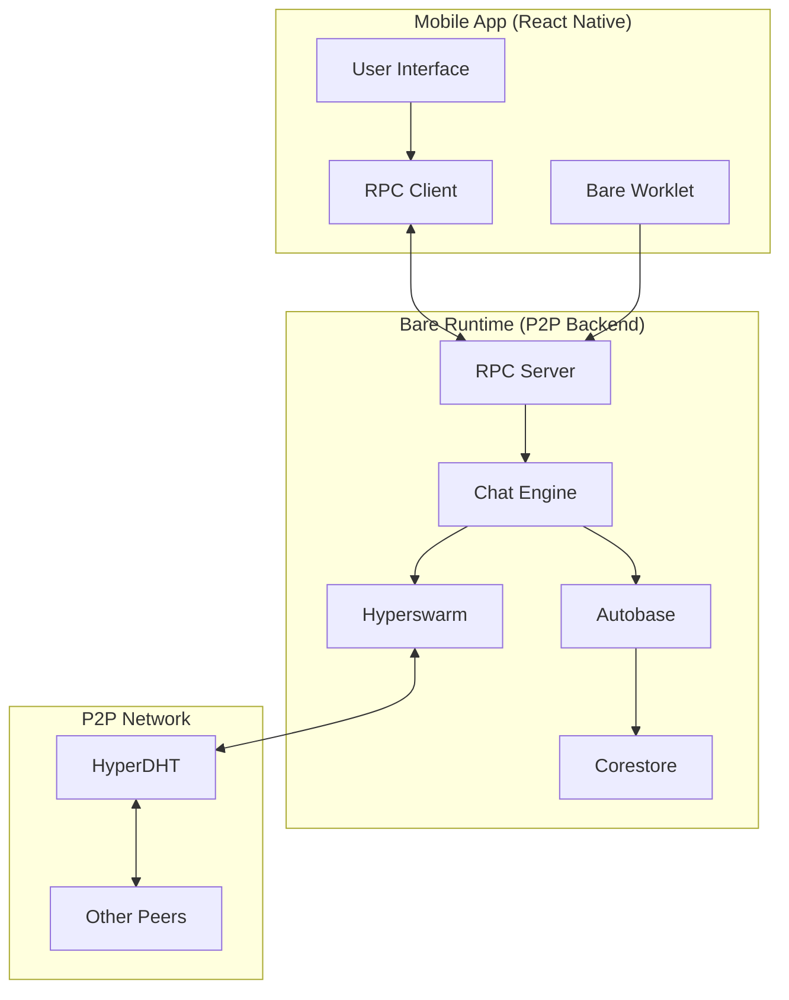

# P2P Chat App Architecture
## Expo React Native + Pears.com Bare

### Table of Contents
1. [Overview](#overview)
2. [Technology Stack](#technology-stack)
3. [System Architecture](#system-architecture)
4. [Core Components](#core-components)
5. [Data Flow](#data-flow)
6. [Security Model](#security-model)
7. [Implementation Plan](#implementation-plan)
8. [Deployment Strategy](#deployment-strategy)

---

## Overview

This document outlines the architecture for a peer-to-peer chat application built using Expo React Native for the mobile frontend and Pears.com Bare runtime for the P2P backend infrastructure. The application leverages Holepunch's distributed networking stack to enable direct peer-to-peer communication without centralized servers.

### Key Features
- **True P2P Communication**: Direct peer-to-peer messaging without servers
- **End-to-End Encryption**: All messages encrypted using Noise protocol
- **Offline-First**: Messages sync when peers come online
- **Multi-Device Support**: Same identity across multiple devices
- **Group Chats**: Multi-writer support using Autobase
- **File Sharing**: Direct P2P file transfer capabilities
- **Cross-Platform**: iOS and Android support via Expo

---

## Technology Stack

### Frontend (React Native)
- **Expo SDK**: Cross-platform mobile development
- **React Native**: UI framework
- **React Native Bare Kit**: Bridge to Bare runtime
- **TypeScript**: Type safety and development experience

### Backend (Bare Runtime)
- **Bare**: JavaScript runtime for P2P applications
- **Hyperswarm**: Peer discovery and connection management
- **Autobase**: Multi-writer append-only database for group chats
- **Hypercore**: Append-only logs for message storage
- **Hyperbee**: Key-value database for metadata
- **Corestore**: Hypercore management and storage
- **bare-rpc**: Communication between React Native and Bare

### P2P Infrastructure
- **HyperDHT**: Distributed hash table for peer discovery
- **SecretStream**: End-to-end encryption using Noise protocol
- **UDX**: Custom transport protocol optimized for P2P
- **Compact Encoding**: Efficient binary serialization

---

## System Architecture



### Architecture Layers

#### 1. Presentation Layer (React Native)
- **User Interface Components**: Chat screens, contact lists, settings
- **State Management**: Local UI state and message caching
- **Navigation**: Screen routing and deep linking
- **Notifications**: Push notifications for new messages

#### 2. Communication Layer (RPC Bridge)
- **bare-rpc**: Bidirectional communication between React Native and Bare
- **Message Serialization**: Efficient data transfer using compact encoding
- **Event Handling**: Real-time updates from P2P backend to UI

#### 3. Business Logic Layer (Bare Runtime)
- **Chat Engine**: Core chat functionality and message handling
- **User Management**: Identity creation and peer authentication
- **Group Management**: Chat room creation and member management
- **File Transfer**: P2P file sharing capabilities

#### 4. Data Layer (Hypercore Stack)
- **Autobase**: Multi-writer database for group conversations
- **Hypercore**: Individual message logs for each participant
- **Hyperbee**: Metadata storage (contacts, settings, chat info)
- **Corestore**: Unified storage management

#### 5. Network Layer (Hyperswarm)
- **Peer Discovery**: Finding other chat participants
- **Connection Management**: Establishing and maintaining P2P connections
- **Topic-based Routing**: Joining specific chat rooms
- **NAT Traversal**: UDP hole punching for direct connections

---

## Core Components

### 1. Chat Engine (Bare Runtime)

```javascript
class ChatEngine {
  constructor(store, keyPair) {
    this.store = store
    this.keyPair = keyPair
    this.swarm = new Hyperswarm({ keyPair })
    this.chats = new Map() // chatId -> Autobase instance
    this.contacts = new Hyperbee(store.get('contacts'))
  }

  async createChat(participants) {
    const autobase = new Autobase(this.store, null, {
      apply: this.applyChatMessage.bind(this),
      open: (store) => store.get('messages')
    })

    // Add participants as writers
    for (const participant of participants) {
      await autobase.addWriter(participant.key, { indexer: true })
    }

    return autobase
  }

  async sendMessage(chatId, content) {
    const chat = this.chats.get(chatId)
    await chat.append({
      type: 'message',
      content,
      timestamp: Date.now(),
      author: this.keyPair.publicKey
    })
  }
}
```

### 2. User Identity Management

```javascript
class UserIdentity {
  constructor(store) {
    this.store = store
    this.profile = new Hyperbee(store.get('profile'))
    this.keyPair = this.loadOrCreateKeyPair()
  }

  loadOrCreateKeyPair() {
    // Load existing keypair or generate new one
    // Store securely in device keychain
  }

  async updateProfile(data) {
    await this.profile.put('info', {
      displayName: data.displayName,
      avatar: data.avatar,
      publicKey: this.keyPair.publicKey,
      updatedAt: Date.now()
    })
  }
}
```

### 3. React Native UI Components

```typescript
interface ChatMessage {
  id: string
  content: string
  author: string
  timestamp: number
  type: 'text' | 'file' | 'image'
}

const ChatScreen: React.FC = () => {
  const [messages, setMessages] = useState<ChatMessage[]>([])
  const [inputText, setInputText] = useState('')

  const sendMessage = useCallback(async () => {
    await rpc.request('sendMessage', {
      chatId: currentChatId,
      content: inputText,
      type: 'text'
    })
    setInputText('')
  }, [inputText, currentChatId])

  return (
    <View style={styles.container}>
      <FlatList
        data={messages}
        renderItem={({ item }) => <MessageBubble message={item} />}
      />
      <MessageInput
        value={inputText}
        onChangeText={setInputText}
        onSend={sendMessage}
      />
    </View>
  )
}
```

### 4. RPC Communication

```javascript
// RPC Commands
const RPC_COMMANDS = {
  SEND_MESSAGE: 'sendMessage',
  JOIN_CHAT: 'joinChat',
  CREATE_CHAT: 'createChat',
  UPDATE_PROFILE: 'updateProfile',
  MESSAGE_RECEIVED: 'messageReceived',
  PEER_CONNECTED: 'peerConnected',
  PEER_DISCONNECTED: 'peerDisconnected'
}

// Bare Runtime RPC Server
const rpc = new RPC(IPC, async (req) => {
  switch (req.command) {
    case RPC_COMMANDS.SEND_MESSAGE:
      await chatEngine.sendMessage(req.data.chatId, req.data.content)
      break
    case RPC_COMMANDS.CREATE_CHAT:
      const chat = await chatEngine.createChat(req.data.participants)
      req.reply({ chatId: chat.key.toString('hex') })
      break
  }
})

// React Native RPC Client
const sendMessage = async (chatId: string, content: string) => {
  const req = rpc.request(RPC_COMMANDS.SEND_MESSAGE)
  req.send({ chatId, content })
}
```

---

## Data Flow

### Message Sending Flow
1. User types message in React Native UI
2. UI calls RPC method `sendMessage`
3. Bare runtime receives RPC call
4. Chat engine appends message to Autobase
5. Autobase replicates to connected peers
6. Peers receive message and update their local state
7. RPC notifies React Native UI of new message
8. UI updates to show new message

### Peer Discovery Flow
1. App starts and initializes Hyperswarm
2. Joins topic based on chat room ID
3. DHT announces presence to network
4. Other peers discover and connect
5. Establish encrypted connections using SecretStream
6. Begin replicating Autobase data
7. Sync message history and real-time updates

### Group Chat Management
1. Chat creator initializes new Autobase
2. Adds initial participants as writers
3. Shares chat invitation (contains Autobase key)
4. New participants join using invitation
5. Existing members approve new writers
6. All participants can send messages
7. Messages are ordered using Autobase linearization

---

## Security Model

### Identity and Authentication
- **Cryptographic Identity**: Each user has a unique Ed25519 keypair
- **Self-Sovereign**: No central authority controls identities
- **Device Binding**: Private keys stored securely on device
- **Multi-Device**: Same identity can be used across devices

### Message Encryption
- **End-to-End**: All messages encrypted using Noise protocol
- **Forward Secrecy**: New keys generated for each session
- **Metadata Protection**: Only participants know chat membership
- **Deniability**: Messages cannot be proven to come from specific sender

### Network Security
- **DHT Privacy**: Partial information shared during peer discovery
- **Connection Authentication**: Peers verify each other's identity
- **Traffic Analysis Resistance**: Direct P2P connections hide metadata
- **No Server Logs**: No centralized logging or monitoring

### Data Protection
- **Local Storage**: All data stored locally on device
- **Encrypted Storage**: Local database encrypted with device key
- **Selective Sync**: Only sync with trusted peers
- **Right to be Forgotten**: Users can delete their data

---

## Implementation Plan

### Phase 1: Foundation (Weeks 1-2)
- Set up Expo React Native project with TypeScript
- Integrate bare-expo template
- Implement basic RPC communication
- Create core Bare runtime structure
- Set up Hyperswarm for peer discovery

### Phase 2: Core P2P Infrastructure (Weeks 3-4)
- Implement Autobase for multi-writer chat
- Create user identity management
- Build basic message sending/receiving
- Implement peer connection management
- Add message persistence with Hypercore

### Phase 3: Chat Functionality (Weeks 5-6)
- Build React Native chat UI
- Implement real-time message updates
- Add group chat creation and management
- Create contact management system
- Implement message history sync

### Phase 4: Advanced Features (Weeks 7-8)
- Add file sharing capabilities
- Implement push notifications
- Create settings and profile management
- Add message search and filtering
- Implement offline message queue

### Phase 5: Security and Polish (Weeks 9-10)
- Enhance encryption and security
- Add input validation and sanitization
- Implement error handling and recovery
- Create comprehensive testing suite
- Performance optimization

### Phase 6: Testing and Deployment (Weeks 11-12)
- End-to-end testing on real devices
- Network resilience testing
- Security audit and penetration testing
- App store preparation and submission
- Documentation and user guides

---

## Deployment Strategy

### Development Environment
- **Local Testing**: Use Expo development client
- **P2P Testing**: Test on local network first
- **Device Testing**: Test on multiple physical devices
- **Network Testing**: Test across different network conditions

### Production Deployment
- **App Stores**: Deploy to iOS App Store and Google Play
- **Over-the-Air Updates**: Use Expo Updates for quick fixes
- **Crash Reporting**: Integrate Sentry for error tracking
- **Analytics**: Privacy-focused analytics for usage insights

### Distribution Strategy
- **Bootstrap Network**: Initial users help bootstrap DHT
- **Invitation System**: Users invite friends to join network
- **Community Building**: Foster early adopter community
- **Documentation**: Comprehensive user and developer docs

### Monitoring and Maintenance
- **Network Health**: Monitor DHT participation
- **Performance Metrics**: Track message delivery times
- **User Feedback**: Collect and respond to user issues
- **Security Updates**: Regular security patches and updates

---

## Technical Considerations

### Performance Optimization
- **Message Batching**: Batch multiple messages for efficiency
- **Lazy Loading**: Load message history on demand
- **Connection Pooling**: Reuse connections across chats
- **Compression**: Compress large messages and files

### Scalability Considerations
- **DHT Load**: Distribute load across DHT nodes
- **Message Limits**: Implement reasonable message size limits
- **Group Size**: Optimize for groups of 2-50 participants
- **Storage Management**: Implement message pruning strategies

### Error Handling
- **Network Failures**: Graceful handling of connection issues
- **Sync Conflicts**: Resolve message ordering conflicts
- **Data Corruption**: Detect and recover from corrupted data
- **Version Compatibility**: Handle different app versions

### Privacy Considerations
- **Metadata Minimization**: Minimize exposed metadata
- **Traffic Analysis**: Resist traffic analysis attacks
- **Contact Discovery**: Secure contact discovery mechanisms
- **Data Retention**: Clear data retention policies

---

This architecture provides a solid foundation for building a truly decentralized, peer-to-peer chat application that respects user privacy and provides excellent performance through direct connections between peers.